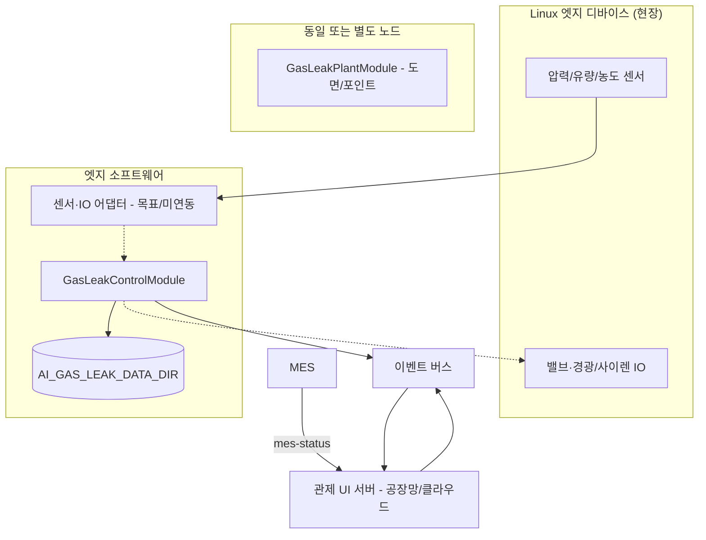

# AI 엣지 컨트롤러 — 개요·사양·요구사항 (Linux 현장 설치)

> **대상:** 가스 공급·용접/절단 작업장에 설치하는 **Linux 기반 엣지 디바이스**  
> **소프트웨어 핵심:** `GasLeakControlModule` (`modules/gas_leak_control/`)  
> **근거:** `services/ai-gas-leak-control/README.md`, `service.yaml`, `gas_leak_control.py`, `run.sh`, `docker-compose.yml`

---

## 1. 개요

### 1.1 역할

AI 엣지 컨트롤러는 현장에서 다음을 수행하는 **실시간 안전 제어 노드**입니다.

| 역할 | 설명 |
|------|------|
| **데이터 수집** | 압력(MPa), 유량(L/min), 가스 농도(%) 등 센서 시계열·스냅샷 수집 |
| **이상 판단** | Rule·(목표) AI 기반 누출·이상 징후 판정 |
| **자동 제어** | 솔레노이드 밸브 차단, 비상 경광등·사이렌 제어 신호 |
| **현장 연동** | MES 설비 가동(Run/Stop)·작업지시 수신으로 **오탐 완화** |
| **이력·버퍼** | 판단·비상·제어 이력 및 단기 시계열 버퍼 유지 |
| **상위 연계** | (선택) 이벤트 버스·관제 UI·데이터 포털로 상태·이력 전달 |

설계상 **Edge AI + Rule-base 하이브리드**이며, 네트워크 단절 시에도 **Rule 기준 차단·로컬 state 유지**가 가능하도록 두는 것이 목표입니다. (상위 MES·관제는 연결 시 동기화)

### 1.2 시스템 내 위치



- **엣지 필수:** `gas_leak_control` 모듈 + 로컬 데이터 디렉터리 + (권장) 이벤트 버스 접근  
- **선택 동일 장비:** `gas_leak_plant`(도면은 용량·UI 용도로 엣지 또는 서버에 둘 수 있음)  
- **관제 UI:** `com.SagoHub.ai-gas-leak-control` UI 서버(기본 외부 포트 **26025**, `service.yaml`)

### 1.3 목표 vs 현재 구현 (엣지 관점)

| 항목 | 목표(사업·README) | 현재 소스 (`gas_leak_control.py`) |
|------|-------------------|----------------------------------|
| AI | LSTM-Autoencoder 시계열 이상 탐지 | **미구현** — 고정 임계 휴리스틱 + `anomaly_detected` 이력 |
| Rule | 농도 **3%** 이상 즉시 차단 | **구현** — `CONCENTRATION_RULE_PERCENT = 3.0` (하드코딩) |
| AI 지속 판정 | 오차 초과 **3초** 유지 시 확정 | **미구현** — `service.yaml` `ai_error_threshold_sec`만 정의 |
| 반응 | **2초 이내** 제어 | 루프 **1초** + 이벤트 즉시 state 저장 (실측·HW 연동 별도) |
| 정확도 | **95% 이상** | 벤치마크·모델 없음 |
| 센서 입력 | 실제 I/O | **시뮬레이터** (`_simulator_loop`) — **엣지 배포 시 어댑터 개발 필요** |
| HW 출력 | 밸브·경광/사이렌 | **state 플래그**만 — PLC/GPIO 드라이버 **별도** |

---

## 2. 사양 (Specification)

### 2.1 기능 사양

| ID | 기능 | 설명 | 구현 |
|----|------|------|------|
| F-01 | 실시간 센서 갱신 | 압력·유량·농도 스냅샷·시계열 | 시뮬 1초 / 실센서 TBD |
| F-02 | Rule 자동 차단 | 농도 ≥ 3% → 밸브·알람·비상 이력 | O |
| F-03 | 임계 이상 이력 | 압력>0.45, 유량>13.5, 농도≥3% | O (고정값) |
| F-04 | MES 오탐 완화 | 비가동 중 유입 감지 이력 | O (`mes_equipment_running`) |
| F-05 | 비상 정지 | `GAS_LEAK_EMERGENCY_STOP` | O |
| F-06 | 밸브 해제 | `GAS_LEAK_VALVE_RESET` | O |
| F-07 | 경광/사이렌 | `GAS_LEAK_ALARM_CONTROL` | O (state) |
| F-08 | 관리자 호출 이력 | `GAS_LEAK_CALL_MANAGER` | O (이력만) |
| F-09 | 상태 조회 | `GAS_LEAK_STATUS_QUERY` | O |
| F-10 | LSTM-AE 추론 | 엣지 추론 | X |
| F-11 | 설정 임계 연동 | `rule_threshold_percent` 등 | X (코드 상수) |
| F-12 | 다단계 policy·유예 | `GAS_LEAK_POLICY_SAVE` 등 | 파이프라인만, 핸들러 X |

### 2.2 데이터·버퍼 사양

| 항목 | 값 | 코드 근거 |
|------|-----|-----------|
| 시계열 버퍼 | 시리즈당 **최대 120점** | `MAX_SERIES_POINTS` |
| AI 이력 | **최대 500건** | `MAX_AI_HISTORY` |
| 시계열 형식 | `{ "t": "ISO8601Z", "v": number }` | `_append_timeseries` |
| 센서 유형 | `pressure`, `flow`, `concentration` | 시뮬레이터·README |
| 단위 | MPa, L/min, % | `gas_leak_plant._unit_from_sensor_type` |
| 로컬 저장 경로 | `AI_GAS_LEAK_DATA_DIR` 또는 `{프로젝트}/data/ai_gas_leak` | `_data_dir()` |

**주요 파일:** `state.json`, `sensors.json`, `timeseries.json`, `ai_history.json`

### 2.3 Rule·판정 사양 (현행 코드)

| 조건 | 동작 |
|------|------|
| `concentration` ≥ **3.0%** | 즉시 `valve_closed`, 경광/사이렌 ON, `rule_concentration`, 관리자 호출 이력 |
| `pressure` > **0.45** MPa | `anomaly_detected` 이력 (자동 차단 없음) |
| `flow` > **13.5** L/min | `anomaly_detected` 이력 |
| `mes_equipment_running == false` + 유량/압력/농도 소량 초과 | 「비가동 중 가스 유입」 이력 |
| `valve_closed == true` | 시뮬레이터 데이터 생성 중단 |

### 2.4 이벤트 인터페이스 (엣지 모듈이 처리)

엣지에서 `module_runner`가 이벤트 버스에 등록·수신합니다.

| 이벤트 | 용도 |
|--------|------|
| `GAS_LEAK_EMERGENCY_STOP` | 비상 차단 |
| `GAS_LEAK_VALVE_RESET` | 밸브 해제 |
| `GAS_LEAK_STATUS_QUERY` | state·sensors·timeseries 반환 |
| `GAS_LEAK_MES_STATUS` | MES 가동·작업지시 → `state.json` |
| `GAS_LEAK_ALARM_CONTROL` | 경광/사이렌 |
| `GAS_LEAK_CALL_MANAGER` | 관리자 호출 이력 |

발행 예: `{ "type": "GAS_LEAK_EMERGENCY_STOP", "payload": { "reason": "manual" } } }`  
(`EventRequest`: `type`, `payload` 필수)

### 2.5 Linux 엣지 하드웨어·OS 사양 (권장)

코드에 최소 사양이 고정되어 있지 않아, **목표 부하** 기준 권장치입니다.

| 항목 | 권장 (최소) | 비고 |
|------|-------------|------|
| OS | **Linux x86_64 / ARM64** (Ubuntu 22.04 LTS 등) | 현장 검증 OS 지정 |
| CPU | 4코어 이상 (AI 추론 도입 시 **8코어 + NPU/GPU** 검토) | LSTM 미도입 시 2코어도 가능 |
| RAM | **4 GB** 이상 (AI 모델 추가 시 **8 GB+**) | |
| 저장 | **32 GB+** eMMC/SSD | 로그·이력·도면 이미지 |
| 네트워크 | 유선 Ethernet (Wi‑Fi는 백업) | 이벤트 버스·MES·관제 |
| 전원 | UPS 권장 | 차단 신뢰성 |
| I/O | RS-485/Modbus, 4~20mA, 디지털 출력(밸브·알람) | **별도 어댑터·PLC 연동** |

### 2.6 소프트웨어·런타임 사양

| 항목 | 사양 |
|------|------|
| 런타임 | **Python 3.10+** |
| 실행 | `modules/gas_leak_control/run.sh` → `module_runner.py gas_leak_control.GasLeakControlModule` |
| 환경변수 | `EVENT_BUS_URL` (기본 `http://localhost:26010`), `POLL_INTERVAL` (기본 5), `PYTHONPATH={프로젝트}/src`, `AI_GAS_LEAK_DATA_DIR` (선택) |
| 프로세스 관리 | systemd / Docker (`services/ai-gas-leak-control/docker-compose.yml`) |
| 의존 | SagoHub 코어(`src/SagoHub`), **이벤트 버스** 기동 필요 |
| 컨테이너 | `sagohub-service-ai-gas-leak-control`, 포트 **26025**, `EVENT_BUS_URL` 외부 지정 |

---

## 3. 요구사항

### 3.1 기능 요구사항 (엣지 필수)

1. **FR-E01** Linux에서 `GasLeakControlModule`이 **상시 기동**되어야 한다.  
2. **FR-E02** 센서 데이터를 **1초 이내 주기**로 수집·반영할 수 있어야 한다. (현재 시뮬 1초; 실센서 동일 목표)  
3. **FR-E03** 가스 농도 **Rule 임계(기본 3%)** 초과 시 **2초 이내** 밸브 차단 명령이 나가야 한다. (목표; HW 지연 포함 검증)  
4. **FR-E04** 비상 차단·밸브 해제·알람 제어를 **이벤트 또는 로컬 UI**로 수행할 수 있어야 한다.  
5. **FR-E05** MES 설비 가동 정보를 수신·반영하고, **비가동 중 이상 유입**을 구분해야 한다.  
6. **FR-E06** 판단·비상·제어 이력을 **로컬에 영속 저장**하고, 상위로 전송 가능해야 한다.  
7. **FR-E07** 네트워크 단절 시에도 **Rule 차단·로컬 state**가 동작해야 한다. (상위 동기화는 복구 후)

### 3.2 기능 요구사항 (로드맵·목표)

1. **FR-E10** LSTM-Autoencoder **엣지 추론** (ONNX/TensorRT 등).  
2. **FR-E11** `rule_threshold_percent`, `ai_error_threshold_sec`를 **설정 파일·UI**에서 변경 가능.  
3. **FR-E12** Modbus/OPC-UA 등 **실제 센서·밸브 I/O** 어댑터.  
4. **FR-E13** 관리자 호출 **외부 알림**(SMS/메신저/전화 API).  
5. **FR-E14** 엣지 → 데이터 포털 **배치/스트리밍 업로드**.

### 3.3 비기능 요구사항

| ID | 요구사항 | 목표 | 현재 |
|----|----------|------|------|
| NFR-01 | 가용성 | 24/7, 자동 재시작 | Docker `restart: unless-stopped` / systemd 권장 |
| NFR-02 | 지연 | 판단·차단 **≤ 2초** | 1초 루프 + HW 미정 |
| NFR-03 | 독립 운영 | 이벤트 버스·파일만으로 제어 가능 | O (파일 기반) |
| NFR-04 | 보안 | 공장망 분리, TLS, 최소 권한 | 배포 정책으로 정의 |
| NFR-05 | 시계 보정 | NTP | OS 설정 |
| NFR-06 | 로그 | 장애·차단 감사 | `ai_history` + 시스템 로그 |
| NFR-07 | 정확도 | 이상 탐지 **≥ 95%** | 미검증 |

### 3.4 인터페이스 요구사항

| 연계 대상 | 프로토콜 | 엣지 측 |
|-----------|----------|---------|
| 이벤트 버스 | HTTP `POST /publish` | `EVENT_BUS_URL` |
| MES | `POST .../mes-status` (보통 UI 서버 경유) | payload: `equipment_running`, `work_order_id` |
| 관제 UI | REST `GET /api/gas-leak/*`, SSE | 엣지는 **데이터 생산**; UI는 별도 호스트 가능 |
| 센서 (목표) | Modbus RTU/TCP 등 | **개발 필요** |
| 밸브·알람 (목표) | DO/PLC | **개발 필요** |

### 3.5 배포 요구사항 (Linux 현장)

1. **DR-E01** `AI_GAS_LEAK_DATA_DIR`를 **영구 볼륨**에 마운트 (재부팅 후 유지).  
2. **DR-E02** `.env`에 `EVENT_BUS_URL`을 **현장 이벤트 버스 IP:포트**로 설정.  
3. **DR-E03** 엣지 단독 시: 이벤트 버스 + `gas_leak_control` **동시 기동** (`run-core.sh` / `run-modules.sh` 참고).  
4. **DR-E04** 관제 UI를 엣지에 함께 둘 경우: `SELECTED_SERVICE=ai-gas-leak-control`, 포트 **26025** 개방.  
5. **DR-E05** 방화·방폭 구역이면 **산업용 PC/게이트웨이** 인증 제품 사용.

---

## 4. 엣지 배포 구성 예시

### 4.1 프로세스 (권장)

```text
[systemd]
  sagohub-event-bus.service   # 포트 26010 (또는 8000)
  sagohub-gas-leak-control.service   # run.sh, EVENT_BUS_URL=...
  sagohub-gas-leak-ui.service        # (선택) 관제, 26025
```

### 4.2 환경 변수 예시

```bash
export AI_GAS_LEAK_DATA_DIR=/var/lib/sagohub/ai_gas_leak
export EVENT_BUS_URL=http://127.0.0.1:26010
export POLL_INTERVAL=5
```

### 4.3 데이터 디렉터리

```text
/var/lib/sagohub/ai_gas_leak/
├── state.json
├── sensors.json
├── timeseries.json
└── ai_history.json
```

---

## 5. 관련 문서

- `docs/데이터포털_등록신청_데이터주요정보_AI가스누출.md` — 포털 등록용 데이터 개요  
- `docs/데이터스키마_AI가스누출_데이터포털형.md` — 필드 스키마  
- `services/ai-gas-leak-control/README.md` — API·이벤트·실행 방법  

---

*문서 버전: SagoHub 저장소 `gas_leak_control` 기준. 엣지 실장 시 센서·I/O·AI 모델 도입에 따라 사양을 개정하세요.*
